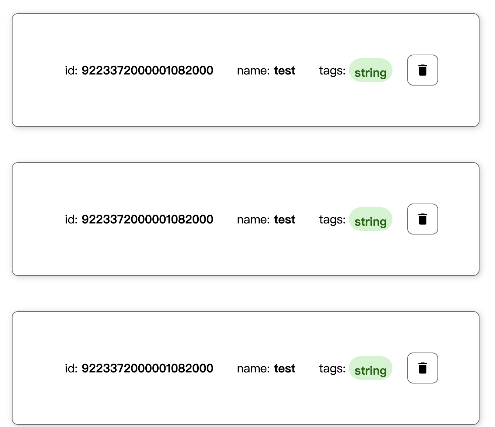

 [Possible Features](#1)


We are intending to indicate the overview of this chapter here at first. This chapter is mainly about features, which are the functions the users will use in the reality. All the features should be created and designed for users, treating users are the center of the whole process. 

The target users of our website are in two separated groups, one is customers group, who are the potential pets-buyers, they are the people who are able to choose online shopping and meanwhile are interested in adopting a pet. The other one should be the pet store host group, or we call it seller. This group probably contains only one person, or perhaps is consist of a couple of members. No matter how many people does it have, it will never have influence on one truth, which is the sellers and buyers must use different features and have to handle problems on different pages.

As above we discussed, our website will be developed by two routes, but synchronized. From the phase of user research, to features choosing, and finally implementing, we are going to keep focus on both two sides. Deciding this working principle have efficiency of development, by avoiding different features for various user groups twisting together, then make the develop process clear, dedicated, and logical. 

Nonetheless, we will definitely not create two websites for two different groups, which looks like a bit counterproductive. Therefore we are preparing to develop a single website which has two mode, switching by a pair of buttons somewhere. In advance of programming we determined that.

# Possible Features<a name='1'></a>

- For buyers:

1. Reviews from history user.
2. Pets’ photos showing.
3. Filtering pets’ categories.
4. Creating account of the website.

- For sellers:

1. GUI for editing pets’ information.
2. Adding pets (already existed)
3. Modifying pets.
4. Deleting pets (already existed)
5. List all pets (already existed)
6. Searching pets.

- For both:

1. Message pad showing operations.
2. Reporting suggestion.
3. Help center.


**What new feature(s) have we chosen to add ?**

**Features already exists: (undistinguished)**

1. List of pets.
2. Adding new pet.
3. Deleting a pet.

**New features we have chosen to add:**

- **For sellers:**

1. Authentication of Seller mode, avoiding customer access wantonly.
2. Add link button on list pets to show pets details.
3. Modifying pet’s information.
4. Uploading pet’s photo URL.
5. Searching a certain pet.

- **For buyers:**

1. User account registering.
2. User login.

1. User information showing.
2. Modifying user information.
3. Deleting user account.
4. Showing all pets in a list with image.

- **For both:**

1. Message box to show operations feedback.

In reality, product specialists basically choose add features by user demand research and analysis from professional team. Because making user-centered strategic decisions has commonly became a magic weapon to win in the fierce market competition. Although sometimes some user requests are obscure and not easy to achieve, developer group members still try their best to make it work, by all kinds of testing and exploring, where sparing no effort to realize the user’s vision.


Actually we are going to follow such principles, but there is going to be some minor changes, because of the using of public API, which means we cannot access any part of backend. This constraint is such of strength pulling us back, so we have to be considering existing API’s functions, which is based on feasibility analysis concept.

# Feature 1：User Authentication <a name='2.1'></a>

**Sub-features:**

- For-Seller:

1. Verifying administration password page.

- For-Buyer:

1. User account registering.
2. User login.
3. User account information showing.
4. User information modifying.
5. User account deleting.

**Counting:** used 5 APIs.

**Description:** 

After discussion and analysis within our group at the meeting, it was unanimously determined that the users of the site could be divided into two groups, buyers and sellers. So we tentatively deduced that in order to differentiate between the two different groups, there should be different user interfaces on the website, available to these two different groups of users.

Since there are different modes of displaying pages, there should be certain barriers that do not allow two different groups to access each other's pages. This is the first level of authentication. Let's assume for a moment that sellers have one and buyers will have many. So in order to distinguish each individual buyer from accessing other buyers' information, we provide a second layer of authentication, which is what users expect, as we learned during our research.

So the final implementation is that on the seller's page, you have to enter an administrator password, not an account number, because there is only one seller, and this password is only known to the seller, so it prevents buyers from accessing the seller's back office indiscriminately to prevent others from editing pet information, adding and deleting pets. After all, these actions should only be taken by the seller.

On the seller's page, we offer the ability to register users, log in, change account information, delete accounts, etc. The only way to gain access to edit this account information is to enter the correct username and password.

##  1. Justification

**User story:** 

Story 1: As a big fan of online shopping, I want to create an account to buy pets, so that my transaction is guaranteed to be fair and open.

Story 2: As the owner of this shop, I need a relevant and improved GUI for me modify the information of pets easily, so that I’m able to make the site more appealing.

**comments:** This can be considered an advanced feature of the site. But in the early stages of building a website, sending order information to an email seems like a good alternative.

**Question 1:**

Which one do you prefer to sign up to use the website? Compulsory or optional? Why?

**Interviewees 1:** 

1. optional, because that is a time-wasting thing to do if I don't really wish to make an order. You know, just walking around is fairly common while people surfing online.
2. Optional. Because, Data Protection is a big deal nowadays and everybody needs to be cautious when it comes to expose his details to the online world but I don’t mind to put nick name and address for buying process.
3. Optional. I figured when I decided to place an order, I was going to pick it up at a pet store. So just send a confirmation email to my email address. There's no need to log in.
4. It depends. When I just skim the information of lovely pets, I do not want to be asked to sign up. But if I choose one to buy, I really need to create an account to follow my order, which might be critical when I need help.
5. Optional. I think everyone has the right to browse pet images and information through the website. However, you must register an account to buy pets. This will ensure that the transaction is fair and open.

**Discuss:**

In the user survey, it was found that the user login function is necessary, but it is not necessary to only be able to log in and then see the website information. Having an account would make transactions more trustworthy and reliable, but if users just want to have a casual look, the login function should lie quietly to the side and not interfere with other actions.


# Feature 2：Modifying Pet's information<a name='2.2'></a>

**Sub-features:**

- For-seller only:

1. Modifying pets details.
2. Especially add photo URL.

**Counting:** used 1 API.

**Description:** 

From the seller's point of view, he wanted a more usable user interface to manage the pets. However, in the previous demo from Allison we had already implemented Find, Delete and New, so we added a function to change the pet's information. Undoubtedly this is a seller function and does not require the buyer to have access to it.

##  2. Justification

**User story:** As the owner of this shop, I need a relevant and improved GUI for me modify the information of pets easily, so that I’m able to make the site more appealing.

Sellers may use this feature to achieve the following visions, change pet names, categories, status, photos, etc. As it is inevitable that there may be times when the first edit is wrong, or later, for some specific reason, some information needs to be changed, then we provide this interface.

# Feature 3：Searching pets by category or name<a name='2.3'></a>

The last question in our interview asked potential users what features they would like to see added to the site, and one of them said that they would like to see a categorisation feature, an idea that inspired us. After all, this is a very common and necessary feature in our extensive experience with the site, so we decided to add it.

However, this feature will not be implemented as the first step in the development process, it is after all the icing on the cake based on other features, we will ensure the user experience of the other basic features before completing the design of this feature.

##  3. Justification

**Interview Questions:** Do you recommend any different feature that you think will value the pets shop website?

**Interviewee:** Suggested features. I would like to be able to categorize the species so that I can focus more on the type of pet I like.

**User Stories:** As a big fan of dogs, I hope the website could provide the function to search out the list of dogs, so that I focus more on them rather than cats, birds etc.

# Feature 4：Message Pad<a name='2.4'></a>

**Description:** 

This Message Pad is a feature we added to the user, originally during development, which also gives instant feedback on the response to each action, letting the developer know what they are doing, whether the code ran successfully etc.
We just needed to replace the feedback string code with user-friendly text or short sentences that a normal person could understand later in development.
In this way, in addition to the user being able to observe changes in the appearance of the page to see if certain actions have been performed, they can also use this feedback panel to get feedback on their own action history.

##  4. Justification

One of the keys to UI/UX design is how to design feedback for user actions. Sometimes good feedback reminders are more important than good looks and more intuitive than lots of text cues.
Feedback can come in the form of press states, activity indicators, progress indicators, live previews, Toast, dialog boxes, other sounds, etc.
Our Message Pad is a component that brings together some of the ideas from the above and is designed to give feedback to the user and improve the user experience.

# Testing<a name='3'></a>

Although, as mentioned above, the public API has many limitations, such as we cannot request it to add or change functionality, there may be bugs that we don't know why, and there may also be problems with a large number of people accessing it resulting in misplaced data. Please don't be disappointed, our team has prepared some surprises.


We've thought about all these issues in advance and won't really ignore them. Although the Brief says that problems caused by bugs in the API will not be scored, in the spirit of programmers who never stop exploring and are keen to pursue perfection, we will use some special code for processing on the front end to prevent some bugs from occurring. You know, if there are bugs that you don't deal with, they affect the overall functionality and you can't hide from them.


The meaning of the word 'special' here is that actual production level development doesn't take this approach, it's a temporary fix and doesn't really address the root cause of the bug in a positive way. This is to prove that we know that the right way to fix a bug is to actively communicate with the back-end developers and explore the problem together. However, due to restrictions on the use of public APIs, we have had to work around this.


The whole process, from before the start, after each feature has been implemented, and then finally taking shape, contains feedback and response policies to the user survey, but in order to focus more precisely on the feature implementation part, I will not describe it here, as I am sure you have read about it in the section above. This distributed writing style will make the article well organized and easy to read.


We will describe our test development process of features in great detail below, so here is a general list of the following to help you read this document. 

1. API features testing.
2. Some API bugs fixing.
3. Features implementing one by one as component.
4. Putting all components together then arrange routing.

##  1. API features testing. <a name='3.1'></a>

APIs are like spanners in the hands of a car mechanic - if you're not familiar with them, it's hard to use them properly. So our first step is to test the API functionality, both to see what they can do and to find out what problems are potentially present in the implementation. Figuring this out will save time in future development and prevent you from being stuck wondering what a bug is about.

I would like to show results at first, I guess you do so, if you are interested in the details, find them as following.

###  **Pet API test form:**

| No.  | method | path                  | feature        | work? | use?        |
| ---- | ------ | --------------------- | -------------- | ----- | ----------- |
| 1    | post   | /pet/{id}/uploadImage | upload image   | no    | no          |
| 2    | post   | /pet                  | new a pet      | yes   | yes         |
| 3    | put    | /pet                  | update a pet   | yes   | yes         |
| 4    | get    | /pet/findByStatus     | find by status | yes   | special use |
| 5    | get    | /pet/{id}             | get pet        | yes   | no          |
| 6    | post   | /pet/{id}             | update a pet   | -     | no          |
| 7    | delete | /pet/{id}             |                | yes   | yes         |

###  **User API test form:**

| NO.  | method | path                  | feature       | work? | use? |
| ---- | ------ | --------------------- | ------------- | ----- | ---- |
| 1    | post   | /user/createWithList  | create users  | -     | no   |
| 2    | get    | /user/{username}      | get a user    | yes   | yes  |
| 3    | put    | /user/{username}      | update a user | yes   | yes  |
| 4    | delete | /user/{username}      | delete a user | yes   | yes  |
| 5    | get    | /user/login           | login         | no    | yes  |
| 6    | get    | /user/logout          | logout        | -     | no   |
| 7    | post   | /user/createWithArray | create users  | yes   | yes  |
| 8    | post   | /user                 | create user   | -     | n0   |


###  **Pet API test details:**

####  **1. Upload Image:**


Fisrtly we choose one existing pet with id: 10000001, to request to upload an image. Then we get:

```json
// test request: 
curl -X 'POST' \
  'https://petstore.swagger.io/v2/pet/10000001/uploadImage' \
  -H 'accept: application/json' \
  -H 'Content-Type: multipart/form-data' \
  -F 'file=@sampleCat.png;type=image/png'
  
// response body:
{
  "code": 200,
  "type": "unknown",
  "message": "additionalMetadata: null\nFile uploaded to ./sampleCat.png, 6082 bytes"
}

// response header:
 access-control-allow-headers: Content-Type,api_key,Authorization 
 access-control-allow-methods: GET,POST,DELETE,PUT 
 access-control-allow-origin: * 
 content-type: application/json 
 date: Fri,06 Aug 2021 11:22:49 GMT 
 server: Jetty(9.2.9.v20150224) 
```

After operations above, we retrieved this pet details, by get pet by id API:


```json
// verify request:
curl -X 'GET' \
  'https://petstore.swagger.io/v2/pet/10000001' \
  -H 'accept: application/json'

// request body:
{
  "id": 10000001,
  "name": "one",
  "photoUrls": [],
  "tags": [],
  "status": "team2"
}

// request headers:
 access-control-allow-headers: Content-Type,api_key,Authorization 
 access-control-allow-methods: GET,POST,DELETE,PUT 
 access-control-allow-origin: * 
 content-type: application/json 
 date: Fri,06 Aug 2021 11:28:35 GMT 
 server: Jetty(9.2.9.v20150224) 
```

**Conclusion:**

 We can see that at the first step, we got a 200 response code which means uploading an image successfully. But in the next stage, verifying phase, we can see the property array "photoUrls" is empty. This is the evidence to certify POST IMAGE API doesn't work in fact.  

But we still need to implement uploading a photo, we will achieve that and describe in the next part. Fortunately, we tested GET PET BY ID API works well.

####  **2. Add new pet**


```json
// Request URL
https://petstore.swagger.io/v2/pet

// req body with id=0 or without id
curl -X 'POST' \
  'https://petstore.swagger.io/v2/pet' \
  -H 'accept: application/json' \
  -H 'Content-Type: application/json' \
  -d '{
  "id": 0,
  "category": {
    "id": 0,
    "name": ""
  },
  "name": "doggie86",
  "photoUrls": [
    ""
  ],
  "tags": [
    {
      "id": 0,
      "name": ""
    }
  ],
  "status": ""
}'

// Response body
{
  "id": 9223372000001083000,
  "category": {
    "id": 0,
    "name": ""
  },
  "name": "doggie86",
  "photoUrls": [
    ""
  ],
  "tags": [
    {
      "id": 0,
      "name": ""
    }
  ],
  "status": ""
}

// req with certain id we assigned
curl -X 'POST' \
  'https://petstore.swagger.io/v2/pet' \
  -H 'accept: application/json' \
  -H 'Content-Type: application/json' \
  -d '{
  "id": 20002020,
  "category": {
    "id": 0,
    "name": ""
  },
  "name": "doggie87",
  "photoUrls": [
    ""
  ],
  "tags": [
    {
      "id": 0,
      "name": ""
    }
  ],
  "status": ""
}'

// Response body
{
  "id": 20002020,
  "category": {
    "id": 0,
    "name": ""
  },
  "name": "doggie87",
  "photoUrls": [
    ""
  ],
  "tags": [
    {
      "id": 0,
      "name": ""
    }
  ],
  "status": ""
}
```

**Conclusion:**

As we can see above, if we assign id = 0 or directly delete the line of assigning an id, we will get a response of creation of new pet with such a long id from backend. (Spoiler: this long id will cause problems, will discuss it later) But if we assign an id with certain number we made, then the new pet will be created with this id. This is a important find that will help us to fix errors later. 

####  **3. Update an existing pet**


```json
// Response body (with 200)
{
  "id": 20002020,
  "category": {
    "id": 0,
    "name": "string"
  },
  "name": "doggie2",
  "photoUrls": [
    "string"
  ],
  "tags": [
    {
      "id": 0,
      "name": "string"
    }
  ],
  "status": "available"
}
```

**Conclusion:**

Nothing special about this API, it works well. The usage of it is input the pet's id that you want to modify into the body, and just fill in other information you want to modify into the body.

####  **4. Find pets by status**


This API works well without any bugs, but helped us find an other bug: the backend used big int type for the id which are automatically generated. And at frontend JS and json.parse() cannot handle that big int, result in lose precision of the number. Here we are going to discribe how we find it and verify it is certain error instead of others. Next chapter we will discuss how we "fix" it by avoiding it happens.


You can see the screenshot below of the website demo from teachers. When I see this page fisrt time, I was curious about why the ids were the same, which was not reasonable.



So we choosed to test it with demo website display, Chrome debug mode preview Response, Chrome raw Response, and POSTMAN Response below. 

**Demo website display:**


So I checked in debug mode of Chrome, then found screenshots below:

**Preview of response in Chrome:**


**Raw response in Chrome:**


**Response in PostMan:**


We found that in Postman and Chrome raw results, this pet object has the real id with accurate number, but in the demo site and Chrome preview stage, it shows fake id with losing precision. Then we compared serval pet objects, which had the same problem. So the truth is all the pets has unique id, but sometimes the real id cannot be displayed correctly.

We infered that Postman can do it because it is a mature tool, they must has some operations of displaying big int, or probably it didn't use JS, because after research we know that other languages don't have this big int problem when calling HTTP request, like python. The comparison of Raw and Preview from chrome has proved our inference. The problem occurs at the stage transfering from string to object, which is json.parse().

Our deduction is not without foundation, and the final nail in the coffin is the two screenshots below.

- We have the data model introduced in https://petstore.swagger.io/ .


- We have known that the biggest number json parse in JS can handle is 9007199254740991, 


and all pets were wrongly displayed whose id is bigger than the MAX number.

We searched a lot about this problem. Most developers fix it by letting backend not using such a big int or asking backend to respond a string back. 

We knew that we were using a public API and that it would be impractical to change the backend as a matter of common sense, but we gave up and went on to find another way.

Then we found a library of tools that can handle big int on the front end. reference link below, https://github.com/sidorares/json-bigint. We thought that the problem was about to be solved, but we were not able to use it without problems. Again, we found other developers on https://github.com/angular/angular.js/issues/8030 that were not able to use this tool in Angular's framework, and we had to regretfully abandon this solution.

Eventually we decided to generate our own short IDs on the front end. The exact implementation process will be explained in the next section.

####  **5. Delete a pet**


Tested working well.

```json
// Request
curl -X 'DELETE' \
  'https://petstore.swagger.io/v2/pet/10000001' \
  -H 'accept: application/json'

// Response (200)
{
  "code": 200,
  "type": "unknown",
  "message": "10000001"
}

```

###  **User API test details:**

####  **1. Get a user:** 


Tested working well.

```json
// Reqeust:
curl -X 'GET' \
  'https://petstore.swagger.io/v2/user/testUserName' \
  -H 'accept: application/json'

// Response:
{
  "id": 9223372000000212000,
  "username": "testUserName",
  "firstName": "testFirstName",
  "lastName": "testLastName",
  "email": "testEmail",
  "password": "testPassword",
  "phone": "testPhone",
  "userStatus": 0
}
```


####  2. Update a user: 


Tested working well.

```json
// Request:
curl -X 'PUT' \
  'https://petstore.swagger.io/v2/user/testUserName' \
  -H 'accept: application/json' \
  -H 'Content-Type: application/json' \
  -d '{
  "id": 0,
  "username": "string",
  "firstName": "string",
  "lastName": "string",
  "email": "string",
  "password": "string",
  "phone": "string",
  "userStatus": 0
}'

//Response:
{
  "code": 200,
  "type": "unknown",
  "message": "9223372000000212378"
}
```


####  3. Delete a user: 


Tested working well.

```json
// Request:
curl -X 'DELETE' \
  'https://petstore.swagger.io/v2/user/testUserName' \
  -H 'accept: application/json'

//Response:
{
  "code": 200,
  "type": "unknown",
  "message": "testUserName"
}
```


####  4. User Login: 


```json
// Request:
curl -X 'GET' \
  'https://petstore.swagger.io/v2/user/login?username=testUserName&password=1' \
  -H 'accept: application/json'

// Response:
{
  "code": 200,
  "type": "unknown",
  "message": "logged in user session:1628266085259"
}
```

If you pay attention, you'll see that I deliberately entered the wrong password in the request, but the API still returns a successful response to the request, which is outrageous. We can only assume that this API is an empty shell for authentication.

####  5. Create a user: 


Tested working well.

```json
// Request:
curl -X 'POST' \
  'https://petstore.swagger.io/v2/user' \
  -H 'accept: application/json' \
  -H 'Content-Type: application/json' \
  -d '{
  "id": 0,
  "username": "testUserName",
  "firstName": "testFirstName",
  "lastName": "testLastName",
  "email": "testEmail",
  "password": "testPassword",
  "phone": "testPhone",
  "userStatus": 0
}'

// Response:
{
  "code": 200,
  "type": "unknown",
  "message": "9223372000000212341"
}

```

At this point it is easy to see that not all Responses return an Object (pet or user) but it can be seen that, with the exception of the Object type, the type returned is the ApiResponse type in the data model of the public API. By sorting out the various API return types, we will be able to handle responses correctly in the rest of the development process, rather than blindly without knowing what the response is.


##  2. Some API problems fixing. <a name='3.2'></a>

I apologize for the title, it may be misleading as we don't have access to API configuration and naturally we can't fix problems really, but please excuse me while I explain in detail. To use a metaphor, if you are building a wooden table and the drawing says you should use M6 nominal diameter screws, but you only have M7 screws, it's not impossible to use them. So we do the same thing and will do something on the front end to compensate for the inconvenience of a public API. This is exactly what I call "fix".

As usual, we list all the problems that we fixed here firstly.

1. Backend respond big int type id.
2. Upload fake image from API.
3. A/B double-face backend.
4. User Login always respond 200.

###  Backend respond big int type id.

Resolving problems by cutting them to pieces then fix little ones is a wisdom way. For this circumstance, we can divid the main problem to two separated problems, one is to generate normal int type id from frontend then assign it to the pet in the body. The other one could be how to retrieve all the pets that we assigned our own ids when we get pet list from the backend.

I have to mention that we have no access to modify backend again, so we realize that there is a ready-made feature for us, which is API findByStatus. Although we know that this API is built for marking pet's status, available, pending, and sold. But one more thing that we know is that, in this assessment, we will not get that further like making real orders and managing pet's status. So that, we decides to use this API for another purpose, not its initial purpose. In the future, if we have opportunities to do more further on this project, for example, we would have access to the backend, then we will create brand new API for this feature and give tha API findByStatus back to its own working place.

```typescript
// pets-list.component.ts (code snippets)

add(name: string): void {
    name = name.trim();
    let id = 10000001
    let status = 'team2'
    if (!name) { return; }
    
    if (this.pets.length > 0){
      this.pets.map(pet => {
        this.idArray.push(pet.id)
      })
      id = Math.max(...this.idArray) + 1
    }
    
    this.petService.addPet({ name, id, status } as Pet)
      .subscribe(pet => {
        this.pets.push(pet);
      });
  }
```

```typescript
// pet.service.ts (code snippets)

private petsUrl = 'https://petstore.swagger.io/v2/pet/findByStatus?status=team2';  // URL to web api

  // get all our own pets with our own ids
  getPets(): Observable<Pet[]> {
    this.http.get<Pet[]>(this.petsUrl)
    return this.http.get<Pet[]>(this.petsUrl)
    .pipe(
      tap(_ => this.log('fetched pets')),
      catchError(this.handleError<Pet[]>('getPets', []))
    );
  }
```

As code above showing, the whole logic and process is that if there is any our team2's pets, we will create first one with id=10000001, else if there is already existing an our own pet, we will get that pet's id and give new pet id 1 more than that older pet's id. And the most frequent situation is there are already having a lot of pets, then we will get all the existing pets id in a array then find the biggest one then plus one, which is going to be the newst pet's id. In this way our own pets' id will be unique.

We will not only passing the id into the body then request HTTP, but also add "team2" as the value of the status property of each pet. So that when we need to find all our own pets, we just need make a get  request with path: https://petstore.swagger.io/v2/pet/findByStatus?status=team2. 

We also considered what to do if someone else's team accidentally took over our ID range - after all, it's a public API - and after testing it out, this was not a problem to worry about. We found that one of the special features of the API for creating new pets is that if there is already a pet for that ID, when you create a new pet with the same ID, the new pet will completely overwrite the information of the old one. So we don't have to worry at all about our functionality and data being compromised, it's just someone else who suffers.


###  Upload fake image from API

When we tested out that the API for uploading images was not working well, it immediately occurred to us that because it was a free and public API, if everyone could upload images, the database server in the background would take up a lot of resources, which would be a significant budget. So instead of opening up the permission to upload images, the provider of this API returned a token response of a successful upload, however in reality nothing happened in the background.

This being the case, we conclude that the API backend does not have the ability to manage media files such as images, but we can manage our own media file database, or even a pet shop owner if he were to use our website right now.
Then we just need to add the string with the address of the image to the PhotoUrls array, as it is possible to store string arrays in PhotoUrls.

This API fails, but we found another API for modifying pet information that allows us to modify the string in the PhotoUrls array at the same time as the pet information. Therefore, we used this instead of uploading images. It just says that it requires the user to manage the media files on the web repository on their own and copy the url of the image over to add the image.

```typescript
// pet-details.component.ts
save(url: string): void {
    if (this.pet) {
      this.pet.photoUrls?.push(url)
      this.petService.updatePet(this.pet)
        .subscribe(() => this.goBack());
    }
  }

// pet.service.ts
/** PUT: update the pet on the server */
  updatePet(pet: Pet): Observable<any> {
    this.http.put(this.baseUrl, pet, this.httpOptions).subscribe()
    return this.http.put(this.baseUrl, pet, this.httpOptions).pipe(
      tap(_ => this.log(`updated pet id=${pet.id}`)),
      catchError(this.handleError<any>('updatePet'))
    );
  }
```


We used two images as examples, stored in our other GitHub repository, and tested that the two images were successfully retrieved and displayed correctly on our page.

###  A/B double-face backend

This problem differs from the two above in that we have not figured out why it occurs, nor have we found any cases of the same. Allow me first to describe the phenomenon of the problem.

When we send the same request consecutively every second apart, we receive two different responses alternately. This problem was discovered when we were using the findByStatus API, but it was also later discovered that the same was happening in all of pet's APIs, not in the user-related APIs.

For example, if I send the request Req, again and again, six times, then we will got Response A, Response B, Response A, Response B, Response A, Response B.

It looks like there are two backends receiving data, let's call it, a backend with an A-side and a B-side.

This can have a significant impact on the stability of the site, for example if I request a new pet, which is on side A, then side A has a new pet in the backend and side B does not. When we next open the site at some point and need to fetch the pet, if it happens to be on side B, it returns that there is no such pet, but in reality it should be there. (Although it switches sides in AB during the same request over and over, it is unknown if it is on side A or side B when the site is first opened.)

We were initially plagued by this problem and did not know how to solve it. Then during a team discussion, ideas were exchanged and suddenly a result burst forth. We could send the request twice each time we needed to send it, so that we could ensure that the AB side of the backend was in sync, no matter which side we encountered, we would be facing the same data, and the subsequent operation on the data would be twice, so that we could keep the AB side of the backend in sync. This avoids this tricky problem. Since then, no similar errors have been reported by the front-end.

```typescript
  // get all pets
  getPets(): Observable<Pet[]> {
    this.http.get(this.petsUrl).subscribe()
    this.http.get<Pet[]>(this.petsUrl)
    return this.http.get<Pet[]>(this.petsUrl)
    .pipe(
      tap(_ => this.log('fetched pets')),
      catchError(this.handleError<Pet[]>('getPets', []))
    );
  }

  // get pet by id
  getPet(id: number): Observable<Pet> {
    const url = `${this.baseUrl}/${id}`
    this.http.get(url).subscribe()
    return this.http.get<Pet>(url)
    .pipe(
      tap(_ => this.log(`fetched pet id=${id}`)),
      catchError(this.handleError<Pet>(`getPet id=${id}`))
    )
  }

  updatePet(pet: Pet): Observable<any> {
    this.http.put(this.baseUrl, pet, this.httpOptions).subscribe()
    return this.http.put(this.baseUrl, pet, this.httpOptions).pipe(
      tap(_ => this.log(`updated pet id=${pet.id}`)),
      catchError(this.handleError<any>('updatePet'))
    );
  }

  /** POST: add a new pet to the server */
  addPet(pet: Pet): Observable<Pet> {
    this.http.post<Pet>(this.baseUrl, pet, this.httpOptions).subscribe()
    return this.http.post<Pet>(this.baseUrl, pet, this.httpOptions).pipe(
      tap((newPet: Pet) => this.log(`added pet w/ id=${newPet.id}`)),
      catchError(this.handleError<Pet>('addPet'))
    );
  }

  /** DELETE: delete the hero from the server */
  deletePet(id: number): Observable<Pet> {
    const url = `${this.baseUrl}/${id}`;
    this.http.delete<Pet>(url, this.httpOptions).subscribe()
    return this.http.delete<Pet>(url, this.httpOptions).pipe(
      tap(_ => this.log(`deleted pet id=${id}`)),
      catchError(this.handleError<Pet>('deletePet'))
    );
  }
```


###  User Login always respond 200

This problem seems rather routine, and it is possible for everyone to debug front and back in this way at the beginning of their development. The interface returns a true value directly in response to the completed part of the functionality before a part of the functionality is evening out.

We just felt that this was too perfunctory from a user's point of view and didn't show whether we had got it right or wrong, so we added a password verification link.

Because our API can retrieve all the information about this user via username, then we use the password in this information to compare the password entered by the user. If the user enters the wrong password, we still won't allow him to access his account information and a pop-up will indicate to him that the password he entered is incorrect. The user will not be able to access or even modify the account details until he has entered the correct password.

##  3. Features implementing one by one as component. <a name='3.3'></a>

###  1. For Both Seller and Buyer

####  Feature 1: Switching Buyer/Seller mode

##### Code:

```html
// app.component.html (code snippets)

<span id="modeButton">
      <a id="buyer" class="button" routerLink="/customerSide">
        Buyer
      </a>

      <a id="seller" class="button" routerLink="/host">
        Seller
    </a>
  </span>

<router-outlet></router-outlet>
```

```typescript
// app.component.ts
const routes: Routes = [
  { path: 'customerSide', component: CustomerSideComponent},
  { path: '', redirectTo: '/customerSide', pathMatch: 'full' },
  { path: 'host', component: HostAdminComponent}
];
```

##### Test Screenshots:


####  Feature 2: Message Pad

##### Code:

```html
// messages.component.html
<div id="messageBox" style="padding: 20px;">
        <span>Messages: </span>  
        <button (click)="messageService.clear()">Clear</button>
        <div id="messageContent">
                <div *ngIf="messageService.messages.length"> 
                        <div *ngFor='let message of messageService.messages'> {{message}} </div>
                </div>
        </div>
        
</div>
```

```typescript
// messages.component.ts
import { MessageService } from '../service/message.service';
  constructor(
    public messageService: MessageService
  ) { }

// message.service.ts
export class MessageService {
  messages: string[] = [];

  add(message: string) {
    this.messages.push(message);
  }

  clear() {
    this.messages = [];
  }
}
```


##### Test Screenshots:


###  2. For Seller

####  Feature 1: Authentication for user (Seller)

##### Code:

```html
// host-admin.component.html
<div class="container">
    host password:
    <input [(ngModel)]="passwordInput" placeholder="password">
    <button (click)="check()"> Enter</button>
</div>
```

```typescript
// host-admin.component.ts
	password: string = 'admin'
  passwordInput: string = ''

  constructor(
    private router: Router
  ) { }

  check() {
    if (this.passwordInput != this.password){
      alert('wrong password')
    }
    else {
      this.router.navigateByUrl('/pets') 
      
    }
  }
```


##### Test Screenshots:


####  Feature 3: Showing pets list and Deleting pet

##### Code:

```html
// pets-list.component.html
<div class="container">
    <!-- Showing pets list -->
<table>
    <ul>
        <li *ngFor="let pet of pets">
            <a routerLink="/detail/{{pet.id}}">
                <span>{{ pet.name }}</span>
            </a>
            <span style="width: 40px;">&nbsp;</span>
            <button title="delete pet"
                (click)="delete(pet)">x</button>
        </li>
    </ul>
</table>
</div>
```

```typescript
// pets-list.component.ts
import { PetService } from '../service/pet.service';
import { MessageService } from '../service/message.service';

	pets: Pet[] = []
  idArray: number[] = []

	constructor(
    private petService:PetService,
    private messageService: MessageService
  ) { }

	ngOnInit(): void {
    this.getPets();
  }
  
  delete(pet: Pet): void {
    this.pets = this.pets.filter(p => p !== pet);
    this.petService.deletePet(pet.id).subscribe();
  }
  
// pet.service.ts
  private petsUrl = 'https://petstore.swagger.io/v2/pet/findByStatus?status=team2';  // URL to web api

  // get all pets
  getPets(): Observable<Pet[]> {
    this.http.get(this.petsUrl).subscribe()
    this.http.get<Pet[]>(this.petsUrl)
    return this.http.get<Pet[]>(this.petsUrl)
    .pipe(
      tap(_ => this.log('fetched pets')),
      catchError(this.handleError<Pet[]>('getPets', []))
    );
  }
  
    // DELETE: delete the hero from the server 
  deletePet(id: number): Observable<Pet> {
    const url = `${this.baseUrl}/${id}`;
    this.http.delete<Pet> (url, this.httpOptions).subscribe()
    return this.http.delete<Pet>(url, this.httpOptions).pipe(
      tap(_ => this.log(`deleted pet id=${id}`)),
      catchError(this.handleError<Pet>('deletePet'))
    );
  }
```


##### Test Screenshots:


####  Feature 4: Adding pet

##### Code:

```html
// pets-list.component.html
<!-- add new pet -->
<div>
    <input #petName/>
    <button (click)="add(petName.value) ; petName.value = '' ">Add</button>
</div>

```

```typescript
// pets-list.component.ts
add(name: string): void {
    name = name.trim();
    let id = 10000001
    let status = 'team2'
    let category = {
      id : 0,
      name: ""
    }
    let photoUrls = [""]
    if (!name) { return; }
    
    if (this.pets.length > 0){
      this.pets.map(pet => {
        this.idArray.push(pet.id)
      })
      id = Math.max(...this.idArray) + 1
    }
    
    this.petService.addPet({ name, id, status,photoUrls, category} as Pet)
      .subscribe(pet => {
        this.pets.push(pet);
      });
  }

// pet.service.ts
/** POST: add a new pet to the server */
  addPet(pet: Pet): Observable<Pet> {
    this.http.post<Pet>(this.baseUrl, pet, this.httpOptions).subscribe()
    return this.http.post<Pet>(this.baseUrl, pet, this.httpOptions).pipe(
      tap((newPet: Pet) => this.log(`added pet w/ id=${newPet.id}`)),
      catchError(this.handleError<Pet>('addPet'))
    );
  }
```


##### Test Screenshots:


####  Feature 5: Showing pet's details and Modifying pet's information 

##### Code:

```html
// pet-details.component.html
<div class="container">
    <!-- pet detials -->
<div *ngIf="pet">
    <h2>{{ pet.name }} Details</h2>
    <div>
        <div>
            <span>id:</span>{{ pet.id }}
        </div>
        <div>
            <span>status:</span>{{ pet.status }}
        </div>
        <div *ngIf="pet.photoUrls">
            
        </div>
        <div>
            <input [(ngModel)]="pet.name" placeholder="name">
            <span>url</span>
            <input #imgUrl [(ngModel)]="pet.photoUrls[0]" placeholder="photoUrl"> 
            <span>category</span>
            <input #category [(ngModel)]="pet.category.name" placeholder="category">
        </div>
    </div>


    <button (click)="save(imgUrl.value,category.value)">save</button>
</div>
<button (click)="goBack()">go back</button>

</div>


```

```typescript
// pet-details.component.ts
export class PetDetailsComponent implements OnInit {

  @Input() pet?: Pet
  constructor(
    private route: ActivatedRoute,
    private petService: PetService,
    private location: Location
  ) { }

  ngOnInit(): void {
    this.getPet()
  }

  getPet() {
    const id = Number(this.route.snapshot.paramMap.get('id'))
    this.petService.getPet(id)
    .subscribe(pet => {
      this.pet = pet
    })
  }

  goBack(): void {
    this.location.back();
  }

  save(url: string, category:string): void {
    if (this.pet) {
      this.pet.photoUrls[0] = url
      this.pet.category.id = 0
      this.pet.category.name = category
      this.petService.updatePet(this.pet)
        .subscribe(() => this.goBack());
    }
  }

}

// pet.service.ts
/** PUT: update the pet on the server */
  updatePet(pet: Pet): Observable<any> {
    this.http.put(this.baseUrl, pet, this.httpOptions).subscribe()
    return this.http.put(this.baseUrl, pet, this.httpOptions).pipe(
      tap(_ => this.log(`updated pet id=${pet.id}`)),
      catchError(this.handleError<any>('updatePet'))
    );
  }
```


##### Test Screenshots:


###  3. For Buyer

####  Feature 1: Registering user account

##### Code:

```html
// user-register.component.html
<div class="container">
    <div *ngIf="!status">
        <form>
            <label>username:</label>
            <input [(ngModel)]="username" placeholder="username" name="username"><br>
            <label>first name:</label>
            <input [(ngModel)]="firstName" placeholder="firstName" name="firstName"><br>
            <label>last name:</label>
            <input [(ngModel)]="lastName" placeholder="lastName" name="lastName"><br>
            <label>password:</label>
            <input [(ngModel)]="password" placeholder="password" name="password"><br>
            <button (click)="addUser()"> Resgiter</button>
        </form>
    </div>
    <div *ngIf="status">
        <p>congratulations, register succeed</p>
    </div>
</div>
```

```typescript
// user-register.component.ts
export class UserRegisterComponent implements OnInit {

  username: string = ""
  firstName: string = ""
  lastName: string = ""
  password: string = ""

  status: boolean = false

  constructor(
    private userService: UserService
  ) { }

  ngOnInit(): void {
  }

  addUser() {
    let username = this.username
    let firstName = this.firstName
    let lastName = this.lastName
    let password = this.password

    this.userService.addUser({username, firstName, lastName, password} as User)
    .subscribe(res => {
      if (res.code == 200){
        this.status = true
      }
    })
  }

}

// user.service.ts
 private baseUrl = 'https://petstore.swagger.io/v2/user'

  // create a new user account
  addUser(user: User): Observable<ApiResponse> {
    this.http.post<ApiResponse>(this.baseUrl, user, this.httpOptions).subscribe()
    return this.http.post<ApiResponse>(this.baseUrl, user, this.httpOptions)
      .pipe(
        tap(res => {
          if (res.code == 200){
            this.log(`added user with username: ${user.username}`)
          }
        }),
        catchError(this.handleError<ApiResponse>('addUser'))
      )
  }
```


##### Test Screenshots:


####  Feature 2: Login

####  Feature 3: Showing user account details

##### Code:

```html
// user-login.component.html
<div class="container">
    <div *ngIf="!status">
        <form>
            <label>username:</label>
            <input [(ngModel)]="username" placeholder="username" name="username"><br>
            <label>password:</label>
            <input [(ngModel)]="password" placeholder="password" name="password"><br>
            <button (click)="login()"> Log in</button>
        </form>
    </div>
    <div *ngIf="status">
        <!-- <p>congratulations, login succeed</p> -->
        <app-user-details (backEvent)="logout()" [loginUsername]="username"></app-user-details>
    </div>
</div>
```

```typescript
// user-login.component.ts
export class UserLoginComponent implements OnInit {

  username: string = ""
  password: string = ""

  status: boolean = false
  
  constructor(
    private userService: UserService
  ) { }

  ngOnInit(): void {
  }

  login() {
    let username = this.username
    let password = this.password

    

    this.userService.getUser(username)
    .subscribe(res => {
      if (res){
        if (res.password == password){
          this.status = true
        }else {
          alert('wrong password')
        }
        
      }else{
        alert('not exist user')
      }
      
    })
    this.userService.login({username, password} as User)
    .subscribe(res => {
    })
  }

  logout() {
    this.status = false
  }

}

// user.service.ts
// login check 
  login(user: User) : Observable<ApiResponse>  {
    let url = `${this.baseUrl}/login?username=${user.username}&password=${user.password}`
    this.http.get<ApiResponse>(url, this.httpOptions).subscribe()
    return this.http.get<ApiResponse>(url, this.httpOptions)
    .pipe(
      tap(res => {
        if (res.code == 200){
          this.log(`user with username: ${user.username} logged in succeed`)
        }else{
          // console.log('res')
        }
      }),
      catchError(this.handleError<ApiResponse>('user login'))
    )
  }

  // get user info by username
  getUser(useranme: string): Observable<User> {
    let url = `${this.baseUrl}/${useranme}`
    this.http.get<User>(url, this.httpOptions).subscribe()
    return this.http.get<User>(url, this.httpOptions)
    .pipe(
      tap(user => {
          this.log(`user with username: ${user.username} info shows here`)
      }),
      catchError(this.handleError<User>('user info'))
    )
  }

```


##### Test Screenshots:


####  Feature 4: Editing user information and Deleting user account

##### Code:

```html
// user-details.component.html
<div class="container">
    <div *ngIf="!modify">
        <div *ngIf="user">
            <p>username: {{user.username}}</p>
            <p>first name: {{user.firstName}}</p>
            <p>last name: {{user.lastName}}</p>
            <p>email: {{user.email}}</p>
            <p>phone: {{user.phone}}</p>
            <p>password: {{user.password}}</p>
        </div>
        <button (click)="modify=true">Modify info</button>
    </div>
    
    <div *ngIf="modify">
        <div *ngIf="user">
            <p>username: {{user.username}}</p>
            <input [(ngModel)]="user.username" value="user.username">
            <p>first name: {{user.firstName}}</p>
            <input [(ngModel)]="user.firstName" value="user.firstName">
            <p>last name: {{user.lastName}}</p>
            <input [(ngModel)]="user.lastName" value="user.lastName">
            <p>email: {{user.email}}</p>
            <input [(ngModel)]="user.email" value="user.email">
            <p>phone: {{user.phone}}</p>
            <input [(ngModel)]="user.phone" value="user.phone">
            <p>password: {{user.password}}</p>
            <input [(ngModel)]="user.password" value="user.password">
        </div>
        <button (click)="modify=false; modifyUser()">save</button>
        
        <button (click)="deleteUser(); modify = false">delete account</button>
        
        
    </div>

</div>
```

```typescript
// user-details.component.ts
export class UserDetailsComponent implements OnInit {

  @Input() loginUsername?:string
  @Output() backEvent = new EventEmitter<boolean>();


  user?: User
  emptyUser?: User
  modify: boolean = false

  constructor(
    private userService: UserService,

  ) { }

  ngOnInit(): void {
    this.getUser()
  }
  getUser() {
    this.userService.getUser(this.loginUsername!)
      .subscribe(user => {
        this.user = user
      })
  }

  modifyUser() {
    this.userService.modifyUser(this.user!)
    .subscribe()
  }

  deleteUser() {
    this.userService.deleteUser(this.user!)
    .subscribe(_ => {
      this.user = this.emptyUser
    })
    this.backEvent.emit(true);
  }

}

// user.service.ts
// Modify User
  modifyUser(user: User): Observable<User>{
    let url = `${this.baseUrl}/${user.username}`
    this.http.put<User>(url, user, this.httpOptions).subscribe()
    return this.http.put<User>(url, user, this.httpOptions)
    .pipe(
      tap(user => {
          this.log(`user with username: ${user.username} updated`)
      }),
      catchError(this.handleError<User>('user info updated'))
    )
  }

  // delete user
  deleteUser(user: User): Observable<User>{
    let url = `${this.baseUrl}/${user.username}`
    this.http.delete<User>(url, this.httpOptions).subscribe()
    return this.http.delete<User>(url, this.httpOptions)
    .pipe(
      tap(user => {
          this.log(`user with username: ${user.username} updated`)
      }),
      catchError(this.handleError<User>('user info updated'))
    )

  }
```


##### Test Screenshots:


####  Feature 5: Showing pets list and Searching by conditions

##### Code:

```html
// customer-side.component.html
<div class="container">
    <h1>
        Customer side
    </h1>
        <div *ngFor="let pet of pets" >
                {{ pet.name }}
                {{ pet.id }}
        </div>
        <div>
            <div *ngIf="isL || !isR">
                <button (click)="isRegister()"> register</button>
            </div>
            <div *ngIf="!isL || isR">
                <button (click)="isLogin()"> login</button>
            </div>
            
        </div>
        <div *ngIf="isR">
            <app-user-register></app-user-register>
        </div>
        <div *ngIf="isL">
            <app-user-login></app-user-login>
        </div>
    
    <div>
        <span>find by category</span>
        <input [(ngModel)]="categoryInput">
        <button (click)="fingByCategory()">find</button>
    </div>
        
    <div>
				<span>find by name</span>
        <input [(ngModel)]="nameInput">
        <button (click)="findByNane()">find</button>
    </div>
  <button (click)="clear()">Clear</button>

</div>
```

```typescript
// customer-side.component.ts
export class CustomerSideComponent implements OnInit {

  originPets: Pet[] = []
  pets: Pet[] = []
  categoryInput = ""
  nameInput = ""

  fingByCategory(){
    let returnPets: Pet[] = []
    this.originPets.forEach(pet => {
      if(pet.category.name == this.categoryInput ){
        returnPets.push(pet)
      }
    });
    this.pets = returnPets
  }

  findByNane(){
    let returnPets: Pet[] = []
    this.originPets.forEach(pet => {
      if(pet.name == this.nameInput ){
        returnPets.push(pet)
      }
    });
    this.pets = returnPets
  }
  clear(){
    this.pets = this.originPets
  }

  constructor(
    private petService: PetService
  ) { }

  ngOnInit(): void {
    this.getPets()
  }

  getPets(){
    this.petService.getPets()
    .subscribe(pets => {
      this.originPets = pets
      this.pets = this.originPets
    })
  }

}

```


##### Test Screenshots:


