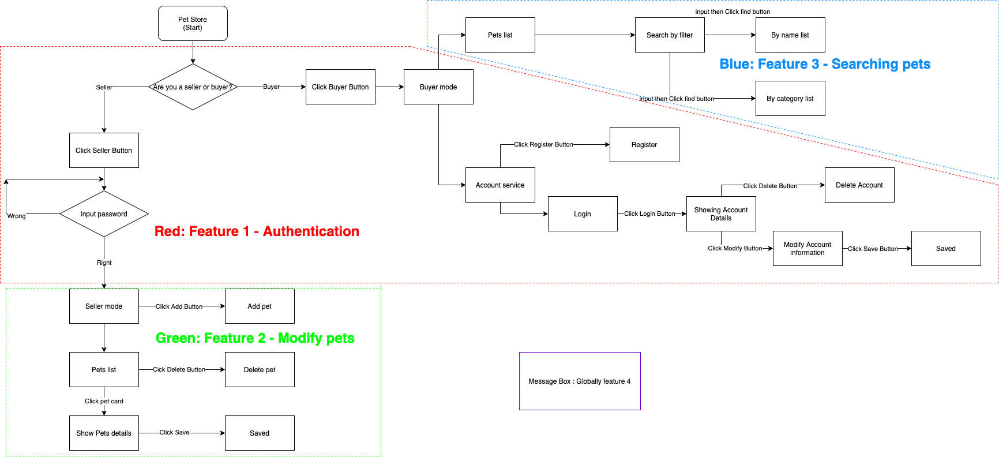

<h1>Content: </h1>

[1. UX Development](#1)

&emsp;[1. Wireframes showing planned design](#1.1)

&emsp;[2. Overall interaction logic](#1.2)

&emsp;[3. Design evolution overtime](#1.3)

[2. Final UX](#2)

&emsp;[1. Theoretical support](#2.1)

&emsp;[2.Frontend developing process](#2.2)

&emsp;[3. Documents](#2.3)

[3. Design Choices](#3)

[4. Evaluation](#4)

&emsp;[1. Before prgramming](#4.1)

&emsp;[2. Within prgramming](#4.2)

&emsp;[3. After feedback from users](#4.3)


<h1>Body:</h1>

" People think it's this veneer -that the designers are handed this box and told,'Make it look good !'That's not what we think design is .It's not just what it looks like and feels like .Design is how it works. " on New York Times from Jobs. Some people think that design means appearance, and that is certainly true, but it would be a mistake to think that design is just about appearance. Because if you dig a little deeper, you'll find that the heart of good design is how it works.

In addition to having the presentation through the gorgeous design and the detailed interaction logic, good product design should also have the functioning of the product itself as its core. For one thing, only by achieving the functionality that users desire can you put your creativity to good use, and for another, a pleasing interaction design is more complex and functional than simply how it looks. Throughout the process of practice, we have to go through countless encounters with users and constantly improve and polish our products before they become treasures.

Our project was carried out with this in mind. In the previous section of the report, Features.md, we have described in detail how we have modularised the implementation of the functionality and its testing part. The first tasks have been completed, but we can't say that it has been smooth sailing and we have found many unexpected bugs in the process. Fortunately, our test-oriented development and use of the principles of modular design made it possible to work on a clear route up front, which allowed each problem to be focused on independently and avoided becoming a highly coupled problem that was twisted together.

In the following, we describe how we put together functional modules that had previously passed the test. The integration was not a simple pile-up, but a matter of thinking through the interaction logic, listening to the user and combining it all together organically. Finally, with the right cosmetic touches, the front-end development is complete.

# <a name="1"></a>UX Development

Whether it is the manufacture of machinery or the construction of a house on site, drawings are required as a basis for realisation. The same is true for our software development. Drawings enable part of the work to be broken down and completed in advance, making the rest of the realisation process industrial and efficient. Drawings are theoretically based, thought out and judged, and verified as correct when they are drawn. So at the stage of implementing there is no need to think about whether what you are doing is correct or why you are doing it, because the work has already been done before, so you can just "close your eyes" and do it. This chapter we are going to show process of generating the "drawing".

## <a name="1.1"></a>Wireframes showing planned design

The event response logic and planning layout is like an invisible thread that strings the pearls of the tested functional modules together to make a necklace.

The design of the functional modules has already been described in detail in the FEATURES section and will not be mentioned here in order to avoid repetition. I will now describe in detail, literally, the layout of the components within the page and their positions, the introduction of event-responsive components, and the logic for jumping between screens.

In this section, we have shown almost everything in one picture. It may seem a bit strange to represent everything in just one picture, but I will explain it to you. Of course, it is best to read this in conjunction with the next two sections, as this will help you to understand what I am describing.

In this session, we had previously chosen to get the team together and draw out the layout of each page on paper, responding to the changes in the layout afterwards, and then use the video format to manually turn the pages to show the interaction logic. It would then be great to demonstrate the video or GIF images in this session. Unlike in the past we won't be using this approach, due to the pandemic we are all spread out on opposite ends of the globe and can't work together face to face. We have found in practice that we can achieve the same effect if we present it in the form of diagrams and text to share with each other. The diagrams and text, on the other hand, are more suited to appear in a paper or report, but of course, it is a challenge for us and an opportunity to improve ourselves.


We have used three colours to differentiate and emphasise different details. Roughly speaking, we use black to indicate existing frames, red circles to indicate interactable areas, red arrows to indicate actions in response to interactive events, such as page changes or jumps, and blue to indicate new sections of content on the page if the page does not jump in response to an event. If the page as a whole changes in response to an event, we use black to indicate the new page.
Having reached an agreement on the role of markup, this diagram is clear at a glance.

- Header and Buyer/Seller Buttons

At the top, in the title bar, we have an Icon and Title, and to the right of them are a pair of buttons Buyer and Seller, which toggle the site mode, as we believe that the site will have two user groups, one for buyers and one for sellers. Buyers will be viewing pet listings or making transactions on this site. The seller will manage the pets he owns on this site, adding or removing them, or even changing their information. Obviously, the needs of buyers and sellers are completely different and need to be split independently, so we use this pair of buttons to switch between the two modes of the site to present to the corresponding people.

- Buyer mode

Under the header, the main content will be presented. This is because we have created this website for the seller, who will use it to serve his customers, the buyers. In addition, the buyers will be a group with a huge number of people. We decided to give priority to the buyer's experience, which is reflected in the fact that the default mode displayed when opening the site is buyer mode and not seller mode.

In buyer mode, the page will be split into two parts, left and right, with the left side occupying a larger proportion of the width, in order to display more visual and clear information about the pet. The right-hand side takes up a smaller proportion of the width and is used to display information related to the user's account.

1. Pets list

   The pet list area will consist of a top and bottom section, at the top will be a control for filtering pets and at the bottom will be a long list of pets consisting of a number of individual pet information cards.

   1. List of pet's card

      The pet information cards are uniform in size and shape and show information about each pet, including id, name, type and picture. Of course, a buy button may be added later, but we are not considering it at this time. 

   2. Filtering by user input

      Users can filter pets by name or species, the name and species can be entered entirely by themselves and then simply click the find button to filter the pets below into the category they want to see. Clicking the clear button restores the list to its original state.

2. Account area

   In this area, users can perform a number of operations related to their accounts, such as registering, logging in, modifying information and deleting accounts. 

   1. Register and Login

      This is because the login function is considered to be used much more frequently than the registration function. So by default the login page is displayed and if the user needs to register a new account, they need to click on the register button to register a new account by username, name and password.
      The login function will check if the login account exists and if the password is correct, and if there is a problem, it will respond to the corresponding alert event, and if the account password is correct, it will jump to the account details page.

   2. Account information

      On this page the user can see their account information and can also choose to click on modify to change their account information or delete their account. After modifying your account information you should be redirected back to the details page and after deleting your account you should be redirected back to the login page as this account no longer exists.

- Seller mode

  In order to prevent ordinary users from being able to access the buyer's mode, we have added a password verification link so that only sellers who know the password can access the following content, which we will call the back office of the pet shop, as it is here that sellers are able to have a graphical interface to add, delete and modify pets. As the public API does not have a pathway for seller authentication, we have fixed the password on the front end for now, so that if more development steps are available in the future, the authentication API can be easily added.

1. Authenticating page

   This is a page with only one input box, simple and clean, without any other information to display. If the wrong password is entered, the browser should send a corresponding alert box, and if the password is correct, access to the back office of the pet shop is confirmed.

2. Pets managing page

   1. Add a pet

      In this pet shop back office graphical interface you will see two sections, top and bottom, with an input box for creating new pets. All you need to do is add the pet's name to the input box and click the add button. This is the most intuitive and logical way to create a new pet based on its name, and then if you need to add additional information to the pet, this is done later.

   2. Pets list and modify pet's information

      Apparently this is the second half of this page, which can be infinitely long, as long as it depends on how many pets there are. Below this we can see a column of pet information cards, each card shows all the information about a pet, including id, name, species, picture, plus a delete button which the seller can click to remove the pet. Of course, if the seller needs to change the pet's information, simply click on the area of the card other than the delete button and the page will be linked to another path where the individual pet's details will be displayed along with an edit input box and a save button.

## <a name="1.2"></a>Overall interaction logic

While the previous section focused on page composition and layout, this section will focus on the links between its components and between pages.

To more clearly represent the page interaction logic, we will use another diagram to show it. Without further elaboration, let's go straight to the diagram. This diagram represents all our pages, functions, events that can be responded to, and the changes that occur in response to events. Our wesite has double mode for seller and buyers, so There is going to be two main parts of the graph, one is growing to right, is buyer mode, the other is growing underward, is seller mode.

In Buyer mode, users can see a pet list, and they can search pets by inputing names or categories. Of course they can also click clear button to restore the pets list. Apart form this, they can also do some stuff with account service, such as, registering account, login, modifying account information, deleting account.

In Seller mode, at first page, there is authentication part avoiding regular users access inside. If the seller wants to get inside the Seller mode, he just input the password, "admin", then the page will link to a page where seller can manage his pets inventory, including adding new pets, deleting existing pets, modify pets information, or even, add photo URL for each pet.


Those boxes with a blue background are new pages or alerts, the underlined boxes are the components that this page has, and the green dashed lines indicate interaction events and response links. If you look at the map carefully, from the start to the ends, it will be very easy to understand all the operations of our website. If you were confused in the last section, this should make everything clear to you here. We like this graphical presentation and we are sure you will too.

For example, you can see that in the top left hand corner there is a 'Pet Store' which indicates that this is our website and you can take this as a start and then move to the right or down to the bottom of the guide. Each green arrow is an action of your mouse, and the green arrow points to a change in the page corresponding to your action, i.e. a response, which may be a local change in the page or a jump in the page.

Let me give you some examples, such as:

1. Scene: If you want to create a user account, then login and modify your first name, you should follow the line:
   1. Open Pet Store website
   2. Click Buyer mode, then see Buyer mode page
   3. Click Register button, then see register boxes
   4. Input informations needed
   5. Click Register button below, then see succeed feedback message
   6. Click Login button, then see login boxes
   7. Input information needed
   8. Click Login Button below, then see account details
   9. Click Modify Button, then see modify boxes
   10. Change your information
   11. Click Save Button, then link back to details showing
   12. Done.

We were looking for a way to present our four main functions separately, but also to show the connection between the functions and their distribution in the site. We tried to create a flow chart as follows, where we have divided the different functional areas with different colours. The flowchart is used to indicate which actions the user can perform and in what order they are performed.


First we created a flowchart of the entire website, which contains all the potential actions of the website, and then adapted the layout and divided it into four areas with coloured boxes, each of which contains one of our functional areas. For example, the red area, which is the user authentication area, you can see in this area, we can choose whether there is no seller or buyer from the opening of the website, and then carry out the authentication of the seller or the registration of the buyer's account and other operations. Similarly, in the green area we can see that it is full of operations related to the seller's back office management of pets, which sadly contains operations such as adding, deleting, and changing information about pets. Finally we can see the blue area in the top right corner, which is used to provide buyers with the ability to filter the pet listings by information on the page.
Below this is a purple area, the Message box, which is always present globally and provides feedback to the user on almost all actions. This is our feature four.



## <a name="1.3"></a>Design evolution overtime

In this section we will show the evolution of our design in the form of a screenshot set.

- The initial state: 

  Only the necessary functions and button logic are completed, the diagram below shows all the pages.
  
  This image is the first version of our website iteration, and the one without any design. The diagram is not the iterative process of the website and we hope that readers will not misunderstand it. The diagram shows a screenshot of all the pages of the first iteration of our website. In order to reduce the length of the report and to improve readability, we have crammed all the pages into one diagram to try and give you more information. Let me explain, in the first row, from left to right, the list of pets on the buyer's page, the account registration on the buyer's page, the user login on the McStraw page, the user account information on the buyer's page, and the modification of the user account information on the buyer's page. The second row is, the seller password authentication page, the seller pet list and add pet page, and the seller change pet information page.
  
  This image is the first version of our website iteration, and the one without any design. The diagram is not the iterative process of the website and we hope that readers will not misunderstand it. The diagram shows a screenshot of all the pages of the first iteration of our website. In order to reduce the length of the report and to improve readability, we have crammed all the pages into one diagram to try and give you more information. Let me explain, in the first row, from left to right, the list of pets on the buyer's page, the account registration on the buyer's page, the user login on the McStraw page, the user account information on the buyer's page, and the modification of the user account information on the buyer's page. The second row is, the seller password authentication page, the seller pet list and add pet page, and the seller change pet information page.


- First steps taken:
  Two developers work separately on the design, one starting with the overall framework and one with the detailed features and subsequent integration. As the Swagger API uses a black and green colour scheme, we continued the visual style to achieve a uniform visual effect.
  
  This is the beginning of the implementation part of the UI design that we intend to start, please don't think of this as a release or an iteration. This is just to mark the first step in starting UI programming from the point where all our functional testing is complete. The diagram represents, among other things, the beautification of some of the simpler components.


- Buyer mode - Pets list:

  The diagram below shows the complete iterative upgrade process of the pet list in buyer mode.
  
  This diagram represents the development process of the Pet List section in our buyer's mode. As we have two modes of website, in the buyer mode there are again two main sections, one section is the pet listings section and the other is the account services section. In this section we will focus on the development process for the Pet List section.
  
  The process of going from a plain html list to a card containing information about our pets in the final chapter joined our thoughts in between. We felt that the information about each pet should be presented in groups and have a consistent format. So the concept of cards was born. We tried to create a generic template for the cards and then just add different pet information to the template, including names, ids, categories and pictures.
  
  Of course, in addition to the pet card section, we have also added a filtering function above the card list which can also be called a find function. This feature provides buyers with the ability to quickly find pets by name or category. Being at the top here means that it is the most visible place for users to find this feature and means that it will be one of the most used features by users. The green button was chosen to ensure a consistent design throughout the site pages.


- Buyer mode - Account area:

  The diagram below shows the complete iterative upgrade process of the account area in buyer mode. 
  
  In this section, please ignore the left half of each screenshot in the diagram below. Please focus on the change process of the user login screen in the half that is there. Again, it has changed from pure html code to a nice looking form with a nice design.
  It is very good to understand how they evolved. But the static images don't show the animation we have added to this component very well. We have added, specifically for all the blue buttons, a shape responsive animation and a colour responsive animation, so that when the mouse is hovering over it, the lighter blue you see now will turn into a darker blue and the button will widen, indicating to the user that the button is clickable and encouraging you to click it, and also to see if you have clicked the button. It's all about the detail of the UX design.


- Seller mode: 

  The diagram below shows the iterative process of the authentication page, the pet listing, and the edit message page in seller mode.
  
  Below, the iterative process of the seller mode related features, the first two images are flat as plain water. Starting with the last image in the first row, you can see that we have added a background image to the password authentication page, the image has been specially processed by adding a white mask and filter. This was done to emphasise the function of entering the password and to create a welcoming atmosphere with a pet environment. As you can see from the fourth image, we used the same cards as on the buyer's page to display the pet's information. This has gone a long way to ensure consistency in the UI of the site and at the same time, has reduced the amount of duplication of work in the code section. Unlike the cards in buyer mode, the cards here have a delete button which can be used to delete the pet. The card can also be clicked on to link to the last image showing the pet's details. On hovering over a card, the card changes colour and becomes larger, allowing the user to focus on which card to manipulate. The small cursor often disappears on the huge computer screen and is not easy to find, but with this design you can find out which card your mouse is on by simply wiggling it around.


- Message box：

  The diagram below illustrates the evolution of the design of the Message Box, both in terms of its appearance and the improved readability of the text messages.


# <a name="2"></a>Final UX

This is the second version of the iteration of our website, and I have described the iterative process of the components above. The image below shows how all the components look together after the iterative upgrade, and the overall site page is shown here.

In the previous section the results of our user interface were presented, in this section we describe the more technical aspects, some of the code and documentation including the use of the framework.
Along with this task, we received the demo website, which does not use the framework, but only pure JavaScript. pure JavaScript can certainly implement this page, but in general, it is not as beneficial as the framework, where we benefit the most from the modular design and the MVC design pattern.


## <a name="2.1"></a>Theoretical support

We developed frontend by using a coulple of principles, MVC design model, test-driven development, Modular design, Parallel development. With using Angular framework, we can create components for each feature, in which there are mainly three files, *-component.html, *-component.css, and *-component.ts. HTML and CSS file construct the view of one component, while TS file is the controller for the components. 

All the components are the modules in the practise of Modular design, and each component has a View and a Controller. All the Model of MVC is implemented in Data services of Angular. So component is independent, Data is independent, which means eveything could be irrelevant and we can develop each of them paralleled. This way we can save development time and speed up the development process tremendously when we are in a team, because the work is divided up to the point where each person does different jobs at the same time, without affecting each other, and then integrates them together.


The diagram above shows the time flow from left to right, with the top and bottom shown side by side to indicate that tasks can be done at the same time.

## <a name="2.2"></a>Frontend developing process


## <a name="2.3"></a>Documents

First, we should construct the data model we need to facilitate the extraction of valid information from the responses to the http requests.


```typescript
// pet.ts
export interface Pet {
    id: number,
    category: {
      id: number,
      name: string
    },
    name: string,
    photoUrls: [
        string
    ],
    tags?: [
      {
        id: number,
        name: string
      }
    ],
    status: string
}
  
// user.ts
export interface User {
    id?: number,
    username: string,
    firstName: string,
    lastName: string,
    email?: string,
    password: string,
    phone?: string,
    userStatus?: number
}
  
// apiResponse.ts
export interface ApiResponse {
    code: number,
    type: string,
    meassage: string
}
```

Then there are the Data services, the Model part of MVC, where we are requesting the real API, using Angular's built-in HTTPClient class.


```typescript
// pet.service.ts
import { Injectable } from '@angular/core';
import { Observable, of } from 'rxjs';
import { Pet } from '../models/pet';
import { MessageService } from './message.service';
import { HttpClient, HttpHeaders } from '@angular/common/http';
import { catchError, map, max, tap } from 'rxjs/operators';

@Injectable({
  providedIn: 'root'
})
export class PetService {
  httpOptions = {
    headers: new HttpHeaders({ 'Content-Type': 'application/json' })
  };
  private baseUrl = 'https://petstore.swagger.io/v2/pet'
  private petsUrl = 'https://petstore.swagger.io/v2/pet/findByStatus?status=team2';  // URL to web api

  // get all pets
  getPets(): Observable<Pet[]> {
    // Seems like some bug with api, response has two side(A/B), 
    // you will get like ABABABA when you request same api again and again
    // just like it has odd/even side
    // so before return target response, 
    this.http.get(this.petsUrl).subscribe()
    this.http.get<Pet[]>(this.petsUrl)
    return this.http.get<Pet[]>(this.petsUrl)
    .pipe(
      tap(_ => this.log('Get pets list')),
      catchError(this.handleError<Pet[]>('getPets', []))
    );
  }

  // get pet by id
  getPet(id: number): Observable<Pet> {
    const url = `${this.baseUrl}/${id}`
    this.http.get(url).subscribe()
    return this.http.get<Pet>(url)
    .pipe(
      tap(_ => this.log(`Get pet with id: \n\t${id}`)),
      catchError(this.handleError<Pet>(`getPet id=${id}`))
    )
  }

  /** PUT: update the pet on the server */
  updatePet(pet: Pet): Observable<any> {
    this.http.put(this.baseUrl, pet, this.httpOptions).subscribe()
    return this.http.put(this.baseUrl, pet, this.httpOptions).pipe(
      tap(_ => this.log(`Updated pet with id: \n\t${pet.id}`)),
      catchError(this.handleError<any>('updatePet'))
    );
  }

  /** POST: add a new pet to the server */
  addPet(pet: Pet): Observable<Pet> {
    this.http.post<Pet>(this.baseUrl, pet, this.httpOptions).subscribe()
    return this.http.post<Pet>(this.baseUrl, pet, this.httpOptions).pipe(
      tap((newPet: Pet) => this.log(`Added pet with id:\n\t${newPet.id}`)),
      catchError(this.handleError<Pet>('addPet'))
    );
  }

  /** DELETE: delete the hero from the server */
  deletePet(id: number): Observable<Pet> {
    const url = `${this.baseUrl}/${id}`;
    this.http.delete<Pet>(url, this.httpOptions).subscribe()
    return this.http.delete<Pet>(url, this.httpOptions).pipe(
      tap(_ => this.log(`Deleted pet with id: \n\t${id}`)),
      catchError(this.handleError<Pet>('deletePet'))
    );
  }

  constructor(
    private http: HttpClient,
    private messageService: MessageService
  ) { }

  /** Log a PetService message with the MessageService */
  private log(message: string) {
    this.messageService.add(`Pet Service: \n\t${message}`);
  }

  /**
   * Handle Http operation that failed.
   * Let the app continue.
   * @param operation - name of the operation that failed
   * @param result - optional value to return as the observable result
   */
  private handleError<T>(operation = 'operation', result?: T) {
    return (error: any): Observable<T> => {

      // TODO: send the error to remote logging infrastructure
      console.error(error); // log to console instead

      // TODO: better job of transforming error for user consumption
      this.log(`${operation} failed: ${error.message}`);

      // Let the app keep running by returning an empty result.
      return of(result as T);
    };
  }
}


// user.service.ts
import { Injectable } from '@angular/core';
import { HttpClient, HttpHeaders } from '@angular/common/http';
import { User } from '../models/user';
import { Observable, of } from 'rxjs';
import { MessageService } from './message.service';
import { catchError, map, max, tap } from 'rxjs/operators';
import { ApiResponse } from '../models/apiResponse';

@Injectable({
  providedIn: 'root'
})
export class UserService {

  httpOptions = {
    headers: new HttpHeaders({ 'Content-Type': 'application/json' })
  };

  private baseUrl = 'https://petstore.swagger.io/v2/user'

  // create a new user account
  addUser(user: User): Observable<ApiResponse> {
    this.http.post<ApiResponse>(this.baseUrl, user, this.httpOptions).subscribe()
    return this.http.post<ApiResponse>(this.baseUrl, user, this.httpOptions)
      .pipe(
        tap(res => {
          if (res.code == 200){
            this.log(`Added user with username: \n\t${user.username}`)
          }
        }),
        catchError(this.handleError<ApiResponse>('addUser'))
      )
  }

  // login check 
  login(user: User) : Observable<ApiResponse>  {
    let url = `${this.baseUrl}/login?username=${user.username}&password=${user.password}`
    this.http.get<ApiResponse>(url, this.httpOptions).subscribe()
    return this.http.get<ApiResponse>(url, this.httpOptions)
    .pipe(
      tap(res => {
        if (res.code == 200){
          this.log(`User login: \n\t${user.username} logged in succeed`)
        }else{
          // console.log('res')
        }
      }),
      catchError(this.handleError<ApiResponse>('user login'))
    )
  }

  // get user info by username
  getUser(useranme: string): Observable<User> {
    let url = `${this.baseUrl}/${useranme}`
    this.http.get<User>(url, this.httpOptions).subscribe()
    return this.http.get<User>(url, this.httpOptions)
    .pipe(
      tap(user => {
          this.log(`Get user info with username:\n\t ${user.username} info shows here`)
      }),
      catchError(this.handleError<User>('user info'))
    )
  }

  // Modify User
  modifyUser(user: User): Observable<User>{
    let url = `${this.baseUrl}/${user.username}`
    this.http.put<User>(url, user, this.httpOptions).subscribe()
    return this.http.put<User>(url, user, this.httpOptions)
    .pipe(
      tap(user => {
          this.log(`Modify user with username: \n\t${user.username} updated`)
      }),
      catchError(this.handleError<User>('user info updated'))
    )
  }

  // delete user
  deleteUser(user: User): Observable<User>{
    let url = `${this.baseUrl}/${user.username}`
    this.http.delete<User>(url, this.httpOptions).subscribe()
    return this.http.delete<User>(url, this.httpOptions)
    .pipe(
      tap(user => {
          this.log(`Delete user with username: \n\t${user.username} updated`)
      }),
      catchError(this.handleError<User>('user info updated'))
    )

  }

  constructor(
    private http: HttpClient,
    private messageService: MessageService
  ) { }

  /** Log a PetService message with the MessageService */
  private log(message: string) {
    this.messageService.add(`User service:\n\t ${message}`);
  }

  /**
   * Handle Http operation that failed.
   * Let the app continue.
   * @param operation - name of the operation that failed
   * @param result - optional value to return as the observable result
   */
   private handleError<T>(operation = 'operation', result?: T) {
    return (error: any): Observable<T> => {

      // TODO: send the error to remote logging infrastructure
      console.error(error); // log to console instead

      // TODO: better job of transforming error for user consumption
      this.log(`${operation} failed: ${error.message}`);

      // Let the app keep running by returning an empty result.
      return of(result as T);
    };
  }
}


// message.service.ts
import { Injectable } from '@angular/core';

@Injectable({
  providedIn: 'root'
})
export class MessageService {
  messages: string[] = [];

  add(message: string) {
    this.messages.push(message);
  }

  clear() {
    this.messages = [];
  }
}

```

Finally, all the components are shown in the screenshots and are basically explained and shown in code in the Features.md documentation.


# <a name="3"></a>Design Choices

In the UX design philosophy there is one, visual unity. The visual aspect of the website should be consistent and have a visual connection to the business or product. For this project, we decided to continue with the Petstore page on the Swagger Public API website, using green and black as the main colour scheme to maintain a uniformity on the page. In our pages, some of the components with similar functionality are also designed in the same style to give the user the right guidance and avoid misinformation.
Our team initially conceived of arranging all the contents on the web page in turn, so that users can realize all the functions on the same page. However, according to the feedback of test users, lengthy web pages complicate the operation. So we deleted some unnecessary pictures and words. The separation of user interface and seller interface makes the web page concise and clear.

# <a name="4"></a>Evaluation 

## <a name="4.1"></a>Before prgramming

In fact, our user research and API testing were done in parallel, and the details are documented in the Process.md file.
The core of UX design is to understand the real needs of users. Even if your pages are beautiful and your interactions are attractive, as long as you do not provide users with the functions they want, everything is for nothing.
Therefore, before development, we did sufficient user research in the form of questionnaires, polls and interviews. We had questions about what features you expect from the website as a pet buyer and what features you expect as a pet buyer.
In reality, we should leave no stone unturned to fulfil the needs of our users. But being forced to use the public API, we did some feasibility analysis in conjunction with our preliminary API testing. the functionality of the API is limited and we cannot implement all the features that users want. So we chose to develop the features that the users expected, either through the API or through the front-end code. This way we can maximise the functionality that the user wants.
Once the user's functional requirements were met, we then focused on the visual design and interactive experience of the page. [We put evidence inside Process.md](#https://github.com/GuangzheWen/web-softwaretools-plain/blob/main/report/Process.md/#3.3.1)

## <a name="4.2"></a>Within prgramming

The first of Nielsen's Ten Usability Principles, an important reference for product design and user experience design, is the "state of visibility principle": the idea that any action the user takes on a web page, whether it is a click, a scroll or a keystroke, should result in immediate feedback from the page. "Immediate" means that the response time is less than the user can tolerate. The "state visibility principle" is what is often referred to as "feedback".

The interactive user experience is the experience that the interface gives to the user in the process of using and communicating, emphasising the interactive and interactive characteristics. The process of interactive experience runs through the process of browsing, clicking, inputting and outputting to give visitors an experience. The feedback that users get is the most direct interaction, so we take feedback as a key indicator. For example, if the user hovers over a component that can be manipulated, there should be a corresponding response: Curser: pointer, we also designed the animation of the card becoming bigger and changing colour when the user hovers over the pet list card, and so on. We have also designed a special component, Message box, to give feedback to the user. These messages are set up to prompt a phrase in the Message box when the user's website uses an HTTP request to the API and retrieves the data.

In practice, different feedback methods need to be chosen for different scenarios and at the appropriate locations to help users understand and have a better product experience. References: iOS Human Interface Guide, Under Design, Micro Interaction, About Face, The Essence of Interaction Design.

## <a name="4.3"></a>After feedback from users

After the initial completion of the site, a self-assessment by the development team was necessary, but to lighten this part of the workload, we front-loaded some of the testing and validation work. This meant that at this point, we could simply consult the minutes of previous meetings or technical logs to draw preliminary conclusions and the vision we had discussed up front was largely realised.

However, self-assessment within the development team is often not sufficient. It's like being a psychiatrist but having a hard time seeing yourself. We, as developers, are often imprisoned in our own minds and do not see the fuller picture. This is also the case in every part of the development team, where we find that everyone can think of different starting points and directions for the main points. If we rely on the arbitrary decisions of one person, then the results obtained are often one-sided; if we rely on the members working together, then the results will be more comprehensive and dialectical.

Then, looking beyond the perspective of the development team, if we develop a website that has potential users to experience and evaluate it, then they must be able to see a view that we cannot. So we offered our initial website to potential users to experience it and to give us their opinions and suggestions. Based on their ideas, we discuss them internally and if we agree that they are reasonable, then we decide to add or modify the sections accordingly. Here is an analysis of our experience, from a technical point of view.

No matter before the development, during the development of each Feature, or in the final evaluation, our team has always used the method of user interview to obtain users' ideas. There's a reason for the relentless user interviews.

Compared with the questionnaire, the interview method can obtain more real information, because the interview method is the direct language communication between the researcher and the interviewees. Through the efforts of the researcher, the interviewees can relax their mood, eliminate their defensive mentality and express their real thoughts. The interview method basically adopts the question-and-answer method. The interviewees need to respond to the questions in a very short time and cannot think for a long time. At this time, the answers they give are usually spontaneous responses. Interview method can effectively avoid the interviewees do not answer questions or omit questions. Because this is a face-to-face communication between researchers and interviewees, questions are not easy to be rejected.

Members of our group usually conduct user interviews through telephone, so when the interviewees encounter some questions, we will guide them appropriately. After each question, we also have the opportunity to further inquire, so we can discuss some deep-seated questions with the interviewees. In addition, we can also feel the emotions of the other side through the tone of the other side, so as to better grasp our interview.
In the previous study life, members of our group rarely had the opportunity to interview users. As a result, I am not an expert in this area, and some circumstances may not be fully considered when designing the interview outline beforehand. Therefore, in the actual interview process, we can adjust or improve the outline according to the specific responses of the interviewees. If the interviewees do not understand the meaning of the question clearly, misunderstanding the meaning of the question, we can also further explain the question.

Our team members also discussed whether we could explore the needs of users through questionnaire survey. That's certainly one way to do it. However, the design of questionnaire questions needs a lot of experience to control the reliability and validity, and the design of the main contents of the questionnaire directly affects the value of the whole thematic survey. Due to the lack of relevant experience, our team members worry that the questionnaire design is not reasonable and the quality of the questionnaire results cannot be guaranteed. In addition, we cannot find many eligible subjects to participate in the questionnaire survey in a short time. If we post a questionnaire online, are the people who fill it out really our ideal users? Do they really have the patience to configure the environment and so forth to run our site?

Combining the abilities and experience of our team members and the background of the project, we agreed that consistent user interviews were the most effective approach.

1. User request to add a search function

   Through the initial experience of the users, it was felt that our website had basically met their expectations. This is also closely related to the user survey and demand sub-ball that we have done in the early stage. We did develop the website features and page layouts according to the user needs. However, after experiencing the initial website, the users still came up with some new ideas. They wanted to add a lookup function to the site to find by name or pet category. Our development team agreed that such a suggested change was very reasonable and, from a technical point of view, highly feasible. So we added the ability to filter by pet name and category to the top end of the pet list and the tests are working well.

2. User request to change the search function from an exact search to a fuzzy search

   Once the internal functional testing was completed, we made the improved website available for further evaluation by users. We had expected a satisfactory response from our users. However, this was not the case and the users were not happy with the functionality. We were told through interviews that the users were expecting a fuzzy search rather than an exact search. Yes, we did implement the exact search function, for example searching for "dog" only produced results for "dog". What users were expecting was that a search for "d" would bring up "dog" and a search for "dog" would bring up "dog". " and "dogs". In this process, we found that there were differences in understanding the same function, which on the one hand shows that we did not clarify the details of the new user requirements in the first user evaluation feedback. The second aspect also illustrates that evaluation, feedback and communication are positive and effective actions. Although it may only be a matter of a single line of code, the change will make the user experience much better.

3. Post an example of input next to the find box

   To further enhance the user experience, we decided to add a sample input next to the search box "category" so that users know roughly what fields they can enter. This is intended as a guide.

4. FIxed searching input as case insensitive

   Help user by increasing false input tolerance when they are searching for pets.

   

